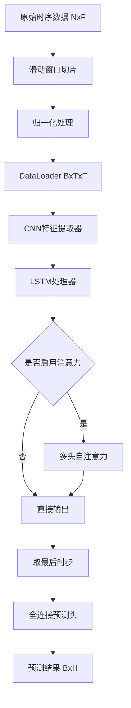

# CNN+LSTM+Attention 时间序列预测框架技术文档

## 1. 项目架构概览

### 1.1 整体设计思路

本项目采用分层模块化设计，将时间序列预测任务分解为特征提取、时序建模、注意力机制和预测输出四个核心阶段：

```
输入数据 (B, T, F) 
    ↓
CNN特征提取 → (B, T, C)
    ↓  
LSTM时序建模 → (B, T, H)
    ↓
Self-Attention → (B, T, H)
    ↓
取最后时步 → (B, H)
    ↓
MLP预测头 → (B, horizon×n_targets)
```

### 1.2 数据流向图解



### 1.3 模块依赖关系

- **配置系统** (`config.py`): 全局参数管理
- **数据管道** (`data_preprocessor.py`): 数据加载与预处理
- **核心模型** (`model_architecture.py`): 整合各子模块
  - CNN特征提取 (`cnn_feature_extractor.py`)
  - LSTM处理 (`lstm_processor.py`) 
  - 注意力机制 (`attention_mechanism.py`)
- **训练框架** (`trainer.py`): 训练循环与优化
- **评估工具** (`evaluator.py`): 指标计算
- **可视化** (`visualizer.py`): 结果展示

## 2. 核心模块详解

### 2.1 CNN特征提取器 (`cnn_feature_extractor.py`)

#### 功能概述
对多变量时间序列进行局部模式提取，保持时间维度不变。

#### 核心实现
```python
class CNNFeatureExtractor(nn.Module):
    def __init__(self, in_channels: int, layer_configs: List[dict], 
                 use_batchnorm: bool = True, dropout: float = 0.0)
```

**输入输出**:
- 输入: `(B, T, F)` - 批次×时间步×特征
- 输出: `(B, T, C)` - 批次×时间步×卷积通道

**关键设计**:
1. **维度转换**: `(B,T,F) → (B,F,T)` 进行1D卷积，再转回 `(B,T,C)`
2. **Same Padding**: 使用 `padding = (kernel_size-1)//2 * dilation` 保持序列长度
3. **模块化层**: 每层包含 Conv1d + BatchNorm + Activation + Pooling + Dropout

**参数配置**:
```python
layer_config = {
    "out_channels": 32,      # 输出通道数 [16-256]
    "kernel_size": 5,        # 卷积核大小 [3,5,7,9]
    "activation": "relu",    # 激活函数 [relu, gelu, elu]
    "pool": "max",          # 池化类型 [max, avg, None]
    "pool_kernel_size": 2   # 池化核大小
}
```

#### 计算复杂度
- 时间复杂度: O(B × T × F × C × K) 其中K为卷积核大小
- 空间复杂度: O(B × T × C)

### 2.2 LSTM处理器 (`lstm_processor.py`)

#### 功能概述
处理时序依赖关系，支持单向/双向LSTM和多层堆叠。

#### 核心实现
```python
class LSTMProcessor(nn.Module):
    def __init__(self, input_size: int, hidden_size: int = 128,
                 num_layers: int = 2, bidirectional: bool = True,
                 dropout: float = 0.0, return_sequence: bool = True)
```

**输入输出**:
- 输入: `(B, T, F_in)`
- 输出: `(B, T, H)` 其中 H = hidden_size × (2 if bidirectional else 1)

**关键特性**:
1. **双向处理**: 同时捕获前向和后向时序信息
2. **多层堆叠**: 增强表征能力，层间dropout防过拟合
3. **状态管理**: 返回最终隐状态用于下游任务

**参数建议**:
- `hidden_size`: 64-256，根据数据复杂度调整
- `num_layers`: 1-3层，过多易过拟合
- `bidirectional`: True通常效果更好
- `dropout`: 0.1-0.3，仅在多层时生效

### 2.3 多头自注意力机制 (`attention_mechanism.py`)

#### 功能概述
实现轻量级多头自注意力，动态关注重要时间步。

#### 数学原理
对于输入序列 $X \in \mathbb{R}^{B \times T \times D}$:

1. **线性变换**: $Q, K, V = XW_Q, XW_K, XW_V$
2. **多头分割**: 将D维分为h个头，每头维度 $d_k = D/h$
3. **注意力计算**: 
   $$\text{Attention}(Q,K,V) = \text{softmax}\left(\frac{QK^T}{\sqrt{d_k}}\right)V$$
4. **多头合并**: 拼接各头输出并线性变换

#### 核心实现
```python
class MultiHeadSelfAttention(nn.Module):
    def __init__(self, d_model: int, num_heads: int = 4, 
                 dropout: float = 0.1, add_positional_encoding: bool = False)
```

**位置编码** (可选):
$$PE_{(pos,2i)} = \sin(pos/10000^{2i/d_{model}})$$
$$PE_{(pos,2i+1)} = \cos(pos/10000^{2i/d_{model}})$$

**计算复杂度**:
- 时间复杂度: O(B × H × T² × d_k)
- 空间复杂度: O(B × H × T²) (注意力矩阵)

**参数配置**:
- `num_heads`: 2,4,8 (需整除d_model)
- `dropout`: 0.1-0.3
- `add_positional_encoding`: 长序列建议启用

### 2.4 主模型架构 (`model_architecture.py`)

#### 整体流程
```python
def forward(self, x: torch.Tensor, return_attn: bool = False):
    y = self.cnn(x)          # (B,T,F) → (B,T,C)
    y, _ = self.lstm(y)      # (B,T,C) → (B,T,H)
    if self.attn is not None:
        y, attn_w = self.attn(y, need_weights=return_attn)
    last = y[:, -1, :]       # 取最后时步 (B,H)
    out = self.head(last)    # (B,H) → (B,horizon×n_targets)
    return out.view(-1, self.horizon, self.n_targets)
```

#### 维度变换追踪
```
输入: (B, T, F)
CNN: (B, T, F) → (B, T, C₁) → (B, T, C₂) → ... → (B, T, C_final)
LSTM: (B, T, C_final) → (B, T, H_lstm)
Attention: (B, T, H_lstm) → (B, T, H_lstm)
Last Step: (B, T, H_lstm) → (B, H_lstm)
MLP Head: (B, H_lstm) → (B, horizon×n_targets) → (B, horizon, n_targets)
```

## 3. 数据处理流程

### 3.1 滑动窗口实现

#### 核心逻辑
```python
def __getitem__(self, idx: int):
    start = idx
    end = idx + self.sequence_length
    target_start = end  
    target_end = target_start + self.horizon
    x = self.features[start:end, self.input_idx]      # (T, F_in)
    y = self.features[target_start:target_end, self.target_idx]  # (H, F_out)
    return torch.from_numpy(x), torch.from_numpy(y)
```

#### 窗口数量计算
总窗口数 = `N - sequence_length - horizon + 1`

其中N为原始序列长度。

### 3.2 归一化策略

#### 防泄漏机制
```python
# 仅基于训练时间段估计统计量
end_idx = min(data.shape[0], n_train + sequence_length - 1)
train_slice = data[:end_idx]
if normalize == "standard":
    mean = train_slice.mean(axis=0)
    std = train_slice.std(axis=0) + 1e-8
elif normalize == "minmax":
    min_v = train_slice.min(axis=0)
    max_v = train_slice.max(axis=0)
```

#### 时序划分策略
采用**时间顺序划分**而非随机划分，避免未来信息泄漏：
```python
idx_train = list(range(0, n_train))
idx_val = list(range(n_train, n_train + n_val))  
idx_test = list(range(n_train + n_val, n_total))
```

## 4. 训练优化策略

### 4.1 损失函数选择

#### MSE (均方误差)
$$L_{MSE} = \frac{1}{N}\sum_{i=1}^{N}(y_i - \hat{y}_i)^2$$
- **适用**: 高斯噪声，关注大误差
- **特点**: 对异常值敏感

#### MAE (平均绝对误差)  
$$L_{MAE} = \frac{1}{N}\sum_{i=1}^{N}|y_i - \hat{y}_i|$$
- **适用**: 拉普拉斯噪声，鲁棒性好
- **特点**: 对异常值不敏感

#### Huber损失
$$L_{Huber} = \begin{cases}
\frac{1}{2}(y-\hat{y})^2 & \text{if } |y-\hat{y}| \leq \delta \\
\delta|y-\hat{y}| - \frac{1}{2}\delta^2 & \text{otherwise}
\end{cases}$$
- **适用**: 兼顾MSE和MAE优点
- **特点**: 小误差用MSE，大误差用MAE

### 4.2 优化器配置

#### Adam优化器
```python
torch.optim.Adam(params, lr=1e-3, betas=(0.9, 0.999), weight_decay=1e-4)
```
- **学习率**: 1e-4 到 1e-2
- **权重衰减**: 1e-5 到 1e-3
- **适用**: 大多数场景的默认选择

#### AdamW优化器
```python  
torch.optim.AdamW(params, lr=1e-3, weight_decay=1e-2)
```
- **特点**: 解耦权重衰减，正则化效果更好
- **权重衰减**: 可设置更大值(1e-2)

### 4.3 学习率调度

#### Cosine退火
```python
torch.optim.lr_scheduler.CosineAnnealingLR(optimizer, T_max=epochs)
```
$$lr_t = lr_{min} + \frac{1}{2}(lr_{max} - lr_{min})(1 + \cos(\frac{t\pi}{T_{max}}))$$

#### 阶梯衰减
```python
torch.optim.lr_scheduler.StepLR(optimizer, step_size=10, gamma=0.5)
```

#### 自适应衰减
```python
torch.optim.lr_scheduler.ReduceLROnPlateau(optimizer, mode='min', patience=5)
```

### 4.4 正则化技术

#### 梯度裁剪
```python
torch.nn.utils.clip_grad_norm_(model.parameters(), max_norm=1.0)
```
防止梯度爆炸，特别适用于RNN类模型。

#### 早停机制
```python
class EarlyStopping:
    def step(self, value: float) -> bool:
        if value < self.best - self.min_delta:
            self.best = value; self.wait = 0
        else:
            self.wait += 1
        return self.wait >= self.patience
```

## 5. 配置系统设计

### 5.1 层次结构
```yaml
model:
  cnn: {layers: [...], dropout: 0.1, use_batchnorm: true}
  lstm: {hidden_size: 128, num_layers: 2, bidirectional: true}
  attention: {enabled: true, num_heads: 4, dropout: 0.1}
  fc_hidden: 128
  forecast_horizon: 3

data:
  data_path: "data/series.csv"
  sequence_length: 64
  horizon: 3
  normalize: "standard"
  batch_size: 64

train:
  epochs: 50
  loss: "mse"
  optimizer: {name: "adam", lr: 0.001, weight_decay: 0.0001}
  scheduler: {name: "cosine", T_max: 50}
  early_stopping: {enabled: true, patience: 10}
```

### 5.2 参数约束
- `model.attention.num_heads` 必须整除 LSTM输出维度
- `model.forecast_horizon` 应等于 `data.horizon`
- `data.sequence_length + data.horizon` 不能超过数据长度
- CNN层的 `out_channels` 建议递增

### 5.3 配置加载
```python
@dataclass
class FullConfig:
    @staticmethod
    def from_dict(cfg: Dict[str, Any]) -> "FullConfig":
        # 递归构建嵌套dataclass
        # 支持JSON/YAML格式
```

## 6. 可视化和评估

### 6.1 训练监控
- **损失曲线**: 训练/验证损失随epoch变化
- **学习率曲线**: LR调度策略效果
- **TensorBoard日志**: 实时监控(可选)

### 6.2 预测分析
- **预测对比图**: 真实值vs预测值的时序对比
- **注意力热力图**: 可视化模型关注的时间步
- **特征重要性**: 基于FC层权重的简单分析

### 6.3 评估指标

#### 回归指标
```python
def regression_metrics(preds, targets):
    mse = torch.mean((preds - targets) ** 2)
    mae = torch.mean(torch.abs(preds - targets))  
    rmse = torch.sqrt(mse)
    mape = torch.mean(torch.abs((targets - preds) / (targets + 1e-8)))
    return {"mse": mse, "mae": mae, "rmse": rmse, "mape": mape}
```

#### 指标适用性
- **MSE/RMSE**: 与原始量纲一致，适合连续值预测
- **MAE**: 鲁棒性好，适合有异常值的场景  
- **MAPE**: 相对误差，适合不同量级数据的比较

## 7. 扩展开发指南

### 7.1 添加新网络层

#### 自定义CNN层
```python
class ResidualBlock(nn.Module):
    def __init__(self, channels, kernel_size=3):
        super().__init__()
        self.conv1 = nn.Conv1d(channels, channels, kernel_size, padding=kernel_size//2)
        self.conv2 = nn.Conv1d(channels, channels, kernel_size, padding=kernel_size//2)
        
    def forward(self, x):
        residual = x
        out = F.relu(self.conv1(x))
        out = self.conv2(out)
        return F.relu(out + residual)
```

#### 集成到CNNFeatureExtractor
```python
# 在layer_configs中添加新类型
if cfg.get("layer_type") == "residual":
    block.append(ResidualBlock(out_c, cfg.get("kernel_size", 3)))
```

### 7.2 自定义注意力机制

#### Transformer Encoder层
```python
class TransformerEncoderLayer(nn.Module):
    def __init__(self, d_model, nhead, dim_feedforward=2048, dropout=0.1):
        super().__init__()
        self.self_attn = nn.MultiheadAttention(d_model, nhead, dropout=dropout)
        self.linear1 = nn.Linear(d_model, dim_feedforward)
        self.linear2 = nn.Linear(dim_feedforward, d_model)
        self.norm1 = nn.LayerNorm(d_model)
        self.norm2 = nn.LayerNorm(d_model)
        self.dropout = nn.Dropout(dropout)
        
    def forward(self, src):
        # Self-attention + residual + norm
        src2 = self.self_attn(src, src, src)[0]
        src = self.norm1(src + self.dropout(src2))
        # FFN + residual + norm  
        src2 = self.linear2(self.dropout(F.relu(self.linear1(src))))
        src = self.norm2(src + self.dropout(src2))
        return src
```

### 7.3 自定义损失函数

#### 分位数损失
```python
class QuantileLoss(nn.Module):
    def __init__(self, quantile=0.5):
        super().__init__()
        self.quantile = quantile
        
    def forward(self, preds, targets):
        errors = targets - preds
        return torch.mean(torch.max(
            self.quantile * errors,
            (self.quantile - 1) * errors
        ))
```

#### 集成到trainer
```python
def _build_loss(name: str) -> nn.Module:
    if name == "quantile":
        return QuantileLoss(quantile=0.9)
    # ... 其他损失函数
```

### 7.4 多GPU训练改造

#### 数据并行
```python
if torch.cuda.device_count() > 1:
    model = nn.DataParallel(model)
    
# 或使用DistributedDataParallel
model = nn.parallel.DistributedDataParallel(model, device_ids=[local_rank])
```

#### 分布式训练设置
```python
import torch.distributed as dist

def setup_distributed():
    dist.init_process_group(backend='nccl')
    local_rank = int(os.environ['LOCAL_RANK'])
    torch.cuda.set_device(local_rank)
    
# 修改DataLoader
sampler = torch.utils.data.distributed.DistributedSampler(dataset)
loader = DataLoader(dataset, sampler=sampler, ...)
```

### 7.5 模型压缩和加速

#### 知识蒸馏
```python
class DistillationLoss(nn.Module):
    def __init__(self, alpha=0.7, temperature=4):
        super().__init__()
        self.alpha = alpha
        self.temperature = temperature
        self.kl_div = nn.KLDivLoss(reduction='batchmean')
        
    def forward(self, student_logits, teacher_logits, targets):
        # 硬标签损失
        hard_loss = F.mse_loss(student_logits, targets)
        # 软标签损失  
        soft_loss = self.kl_div(
            F.log_softmax(student_logits / self.temperature, dim=1),
            F.softmax(teacher_logits / self.temperature, dim=1)
        )
        return self.alpha * soft_loss + (1 - self.alpha) * hard_loss
```

#### 模型量化
```python
# 训练后量化
model_int8 = torch.quantization.quantize_dynamic(
    model, {nn.Linear, nn.LSTM}, dtype=torch.qint8
)

# 量化感知训练
model.qconfig = torch.quantization.get_default_qat_qconfig('fbgemm')
model_prepared = torch.quantization.prepare_qat(model)
# 训练...
model_quantized = torch.quantization.convert(model_prepared)
```

---

## 总结

本技术文档详细阐述了CNN+LSTM+Attention时间序列预测框架的设计理念、实现细节和扩展方法。框架采用模块化设计，各组件职责清晰，便于理解和二次开发。通过合理的配置管理和训练策略，能够适应多种时序预测任务的需求。

开发者可基于此文档深入理解框架原理，并根据具体业务需求进行定制化改造和性能优化。
